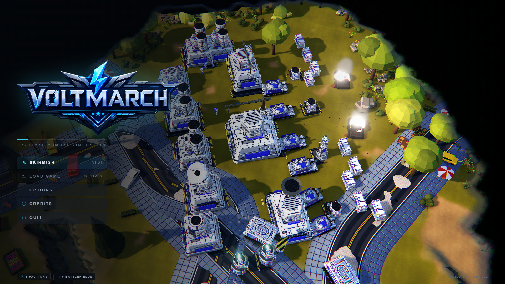

<p align="center">
  
</p>

<p align="center">
  <strong>An original real-time strategy game that runs in the browser.</strong><br>
  Three factions · ore economy · base building · massed armour battles · fog of war
</p>

<p align="center">
  <a href="https://avihaymenahem.github.io/voltmarch/">
    
  </a>
</p>

<p align="center">
  <a href="https://github.com/avihaymenahem/voltmarch/actions/workflows/deploy.yml">
    
  </a>
</p>

<p align="center">
  
</p>

---

## What this is

A full RTS built for the browser: a main menu and settings shell, skirmish setup, three playable
factions with distinct rosters and tech trees, an AI opponent that plays a real game, harvesters and
refineries, power grids that gate production, base placement, fog of war, superweapons, engineer
capture, and a modern bottom-anchored HUD.

VOLTMARCH is not a port or a clone. It is a new title in the tradition of late-90s and 2000s
base-building RTS — the conventions it adopts (harvester economy, tech tiers, build queues) are the
shared vocabulary of that genre.

**All art is generated from code.** No downloaded models, no downloaded textures, no webfonts. Every
unit, building, material and texture is built from Three.js geometry, custom shaders and procedural
canvas generators, which means the entire look can be retuned by editing values rather than
reopening an art tool.

## Running it

```bash
npm install
npm run dev
```

Then open <http://localhost:5173>.

| script | what it does |
| --- | --- |
| `npm run dev` | dev server on port 5173 |
| `npm run build` | production bundle into `dist/` |
| `npm run preview` | serve the built bundle |
| `npm run typecheck` | `tsc --noEmit` across all three programs |
| `npm test` | vitest unit + determinism suites |
| `npm run shots` | capture the visual-critique screenshot set into `shots/` |

`npm run build` deliberately does **not** run `tsc`. esbuild strips types, so a type error must never
be able to stop the game from running; type errors are caught by `npm run typecheck` instead.

`npm run shots` additionally needs Playwright: `npx playwright install chromium`.

## Boot flags

Appended to the URL, e.g. `?art=dusk&seed=1234`.

| flag | effect |
| --- | --- |
| `?shot=<id>` | skip the menu, freeze the sim and pose the camera for a diffable screenshot |
| `?map=<preset>` | map preset |
| `?art=<mood>` | lighting mood — `noon`, `dusk`, `night`, `overcast`, `dust` |
| `?tier=<tier>` | quality override — `low`, `medium`, `high`, `ultra` |
| `?seed=<int>` | deterministic RNG seed |
| `?fog=off` | disable fog of war |

## How the art direction is enforced

The look is held to a measured target rather than to opinion.

[`docs/RA3_LOOK_BIBLE.md`](docs/RA3_LOOK_BIBLE.md) specifies the visual language in falsifiable
terms — camera pitch, light angles and colours, palette hexes, material response, prop density — and
ends in a weighted scorecard where every criterion has an explicit pass condition.

[`tools/metrics.mjs`](tools/metrics.mjs) turns the measurable half of that scorecard into numbers
sampled straight off a rendered PNG: median luminance, mean saturation, black and highlight
percentiles, hue distribution, edge density, aerial-perspective delta. `tools/shoot.mjs` captures a
fixed set of scenarios at 1440p so the two can be run together on every change.

This exists because the failure mode it guards against is invisible from the inside: a render drifts
bright, flat and grey-green while everyone looking at it insists it is fine. A median luminance of
0.53 against a target of 0.34 is not a matter of taste.

## Layout

```
src/core/      simulation spine — types, config, EntityStore/World, event buses, fixed-step loop
src/core/config.ts   art direction + world scale; the single values file that drives the look
src/render/    renderer, scene rig, camera rig, post chain, RenderBridge, __VM debug handle
src/game/      Bootstrap, GameContext, glob system discovery, scenario router
src/shell/     main menu, skirmish setup, settings, pause, victory/defeat
src/ui/        the in-match HUD and in-world overlay
src/sim/       pathfinding, combat, economy, production, AI, vision, superweapons, capture
src/art/       procedural geometry — shape primitives, greeble, unit and building factories
src/world/     terrain, water, roads, decals, prop scatter
src/vfx/       particles, beams, explosions, tracers, pooled scene lights
src/audio/     fully synthesized WebAudio — announcer, barks, weapons, procedural score
src/data/      unit/building/faction/armour tables
tools/         screenshot harness, grade probe, brand asset generator
docs/          look bible, visual DNA, architecture
```

A module joins the game by existing: drop a `*.system.ts` under `src/` that default-exports a
`SystemModule` and [`src/game/Systems.ts`](src/game/Systems.ts) discovers it by glob. Nothing has to
be registered by hand.

## Stack

Vite · TypeScript · Three.js (pinned exact). No React, no game engine, no external art pipeline.
