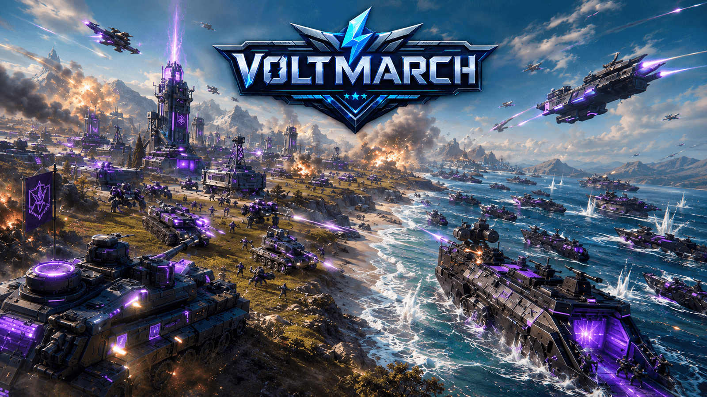
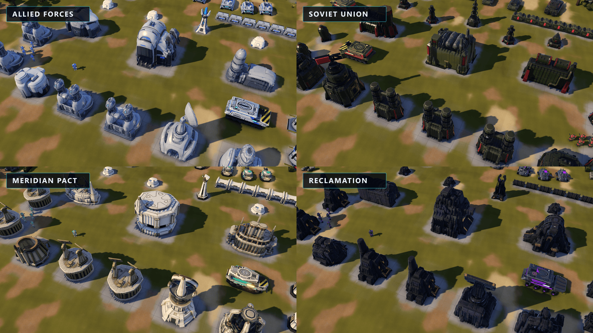
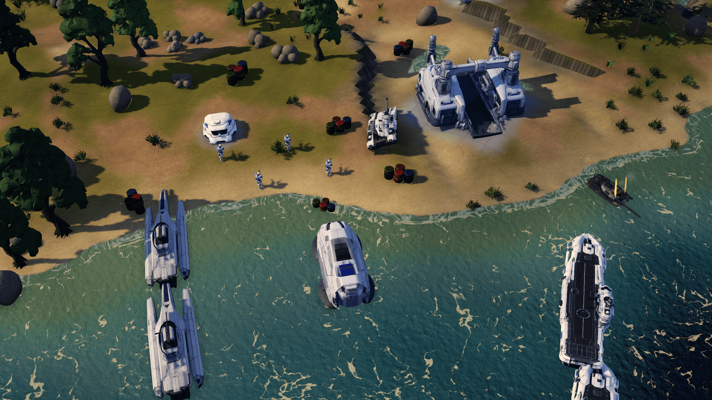

<p align="center">
  
</p>

<p align="center">
  <strong>Build the war machine. Break the line. Own the battlefield.</strong><br>
  A modern base-building RTS for browser and Windows.
</p>

<p align="center">
  <a href="https://play.voltmarch.com/">
    
  </a>
  <a href="https://github.com/avihaymenahem/voltmarch/releases/latest">
    
  </a>
  <a href="https://discord.gg/pvJGJyafU3">
    
  </a>
</p>

<p align="center">
  
</p>

<p align="center">
  <sub>Original VOLTMARCH key art. In-engine captures are shown below.</sub>
</p>

## Command a complete RTS battlefield

VOLTMARCH is an original real-time strategy game built around the classic rhythm of harvesting,
base construction, technological escalation and large combined-arms battles. It is designed to be
immediately readable to genre veterans while pushing each army toward a distinct way of fighting.

- **Four asymmetric factions** with unique buildings, units, defences, powers and visual identity
- **Full base building and economy** with ore harvesting, refineries, power grids and production queues
- **Land, air and naval warfare** including transports, amphibious assaults and island battlefields
- **Campaign, skirmish and multiplayer** with deterministic replays and up to four armies in a match
- **Deep unit control** with formations, stances, veterancy, garrisons, control groups and queued orders
- **Strategic objectives** including civilian capture, commander powers, superweapons and faction progression
- **Built for modern hardware** with WebGPU on desktop, WebGL fallback in browsers and scalable quality settings

<p align="center">
  
</p>

<p align="center">
  <sub>Four factions, four architectural languages. Captured from the current build.</sub>
</p>

## Fight your way

| Mode | What to expect |
| --- | --- |
| Campaign | Authored operations, command briefings, persistent rewards and faction storylines |
| Skirmish | Seven battlefields, configurable armies, multiple biomes and deterministic map previews |
| Multiplayer | Online duels and co-op with commander identities, chat, ally pings and AI takeover on disconnect |
| Replays | Every match records automatically and can be watched from the result screen or replay browser |

The seven skirmish cards use original ImageGen-authored terrain layers made for VOLTMARCH. Starts,
ore fields, map metadata and the tactical scan treatment remain deterministic live overlays, so the
art improves presentation without disguising the map configuration the player is choosing.

The battlefield is more than open ground. Seeded civilian settlement pockets place apartments,
hospitals, mines and oil sites around capturable forward-build space instead of repeating one fixed
layout. Capture them, fortify key lanes, cross water with landing ships, repair damaged armour,
sell exposed positions and use the terrain to hide the shape of your next attack.

Natural ground also carries a project-owner-supplied tileable terrain detail mask, sampled in world
space as colour and roughness variation. Its terrain pass follows only ground, dirt, sand and rock;
the separate road pass reuses the same GPU texture more quietly on asphalt and sidewalk paving,
before crisp lane, slab-edge and kerb treatments are applied.

<p align="center">
  
</p>

<p align="center">
  <sub>An amphibious force approaches the coast on Sunder Atoll.</sub>
</p>

## What's new in 3.12.0

- **Reliable WebGPU match startup:** terrain detail now begins with an immediately uploadable neutral
  texture and swaps to the full-resolution mask after decoding, preventing the production
  `mipLevelCount` crash and flat-orange battlefield on cold starts.

- **Faction-authored construction and air fleets:** all four construction vehicles and aircraft now
  use optimized Meshy assets with generated LOD and shadow variants, including corrected Soviet
  dozer assembly and a rebuilt Reclamation aircraft.
- **Consistent build previews:** the right-side build HUD now renders the same registered imported
  models used in the world instead of retaining obsolete procedural silhouettes.
- **Clean starting deployment:** construction vehicles are imported before their first visible
  frame, removing the procedural-model flash when a match begins with an MCV.

## Play VOLTMARCH

- **Browser:** [play.voltmarch.com](https://play.voltmarch.com/)
- **Windows:** [latest desktop release](https://github.com/avihaymenahem/voltmarch/releases/latest)
- **Community:** [VOLTMARCH Discord](https://discord.gg/pvJGJyafU3)
- **News and updates:** [voltmarch.com](https://voltmarch.com/)

The browser build and Windows release share the same game. The current release is **3.12.0**. The
Windows version uses the native Electron storage and update layers and is WebGPU-first and
WebGPU-locked for normal play.

## For contributors

VOLTMARCH is an npm workspace managed by Turborepo. It requires Node.js 20.19 or newer.

```bash
npm install
npm run dev
```

Open [http://localhost:5173](http://localhost:5173) after the development server starts.

| Command | Purpose |
| --- | --- |
| `npm run dev` | Start the game development server |
| `npm run desktop:dev` | Start the Windows desktop shell in development mode |
| `npm run server` | Start the multiplayer relay locally |
| `npm run website:dev` | Start the marketing site locally |
| `npm run check:affected` | Test, typecheck and build only affected workspaces |
| `npm run check:all` | Run the complete monorepo release gate |
| `npm run shots` | Capture the deterministic visual review suite |

### Repository layout

```text
apps/game/          Browser game and complete game test corpus
apps/desktop/       Electron shell, persistence and desktop updater
apps/relay/         Deterministic multiplayer relay
apps/website/       Cloudflare Pages marketing site and waitlist
packages/protocol/  Shared validated multiplayer protocol
packages/game-types Shared dependency-free game types
docs/               Architecture, art direction and production guides
tools/              Capture, profiling, deployment and asset pipeline tools
```

The simulation runs on a fixed deterministic step. Rendering, audio, interface presentation, chat
and map pings remain outside the lockstep command stream. Imported faction and civilian landmarks
pass through a local game-asset pipeline for topology, PBR materials, reviewed LODs, shadow meshes
and WebGL/WebGPU budgets, with procedural loading/failure fallbacks retained where required.

Useful project documents:

- [Project guide](CLAUDE.md)
- [Campaign build specification](docs/campaign/CAMPAIGN_BUILD_SPEC.md)
- [Visual direction](docs/RA3_LOOK_BIBLE.md)
- [Asset optimization pipeline](docs/ASSET_OPTIMIZATION_PIPELINE.md)
- [Multiplayer relay](apps/relay/README.md)
- [Launch site deployment](apps/website/README.md)
- [Third-party notices](THIRD_PARTY_NOTICES.md)

## License and third-party notices

VOLTMARCH source code and original assets are proprietary and all rights are reserved. Public source
access and the deployed builds do not grant permission to copy, redistribute or create derivative
works. See [LICENSE](LICENSE) and [`THIRD_PARTY_NOTICES.md`](THIRD_PARTY_NOTICES.md) for the complete
terms and bundled third-party attributions.
