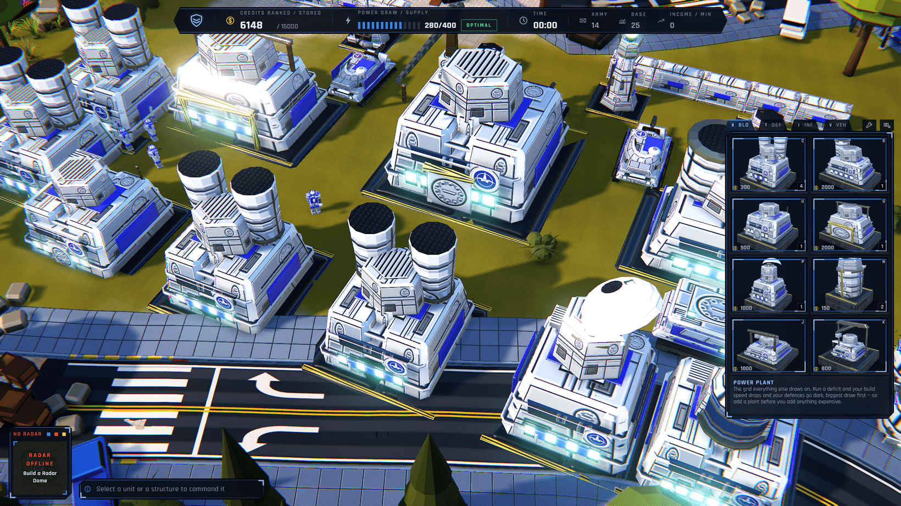

<p align="center">
  
</p>

<p align="center">
  <strong>An original real-time strategy game that runs in the browser.</strong><br>
  Four factions · ore economy · base building · massed armour battles · fog of war
</p>

<p align="center">
  <a href="https://avihaymenahem.github.io/voltmarch/">
    
  </a>
</p>

<p align="center">
  <a href="https://github.com/avihaymenahem/voltmarch/actions/workflows/deploy.yml">
    
  </a>
</p>

<p align="center">
  
</p>

---

## What this is

A full RTS built for the browser: a main menu and settings shell, skirmish setup, four playable
factions with distinct rosters and tech trees, an AI opponent that plays a real game, harvesters and
refineries, power grids that gate production, base placement, fog of war, superweapons, engineer
capture, neutral civilian structures worth fighting over, commander powers bought in the match,
free-for-alls of up to four armies, online 1v1, and a modern bottom-anchored HUD.

The civilian block is the thing engineer capture and infantry garrisons point AT: two mirrored
hamlets sit on the perpendicular bisector between the two openings — equidistant from both armies —
each with an Oil Derrick that pays its holder every second, a hospital and an apartment block that
five riflemen can turn into a firing position. Nobody builds them; you take them, or you clear them
out.

Ten battlefields, three of which carry a real sea. **Sunder Atoll** is the one the navy exists for —
four islands, one army each, 53.8% of the map underwater and no land route between any two of them,
so every crossing is by ship or it does not happen. Nothing on it is progression-gated, because
content required to *reach the enemy* is never a reward: a fresh profile that could not build a
transport would be in a permanent stalemate rather than a hard match.

<p align="center">
  
</p>

VOLTMARCH is not a port or a clone. It is a new title in the tradition of late-90s and 2000s
base-building RTS — the conventions it adopts (harvester economy, tech tiers, build queues) are the
shared vocabulary of that genre.

**All art in the game world is generated from code.** No downloaded models, no downloaded textures.
Every unit, building, material, texture, cameo and in-game icon is built from Three.js geometry,
custom shaders and procedural canvas generators, which means the entire look can be retuned by
editing values rather than reopening an art tool.

Three shipped assets are not generated, all deliberate:

- **Rajdhani** (OFL-1.1), the UI text face, self-hosted in `public/fonts/` — Latin subset, four
  weights, 60 kB — rather than loaded from a CDN, so there is no third-party request and the build
  still runs offline and from a `file://` path.
- **The brand lockup** in `public/brand/` — the wordmark on the title screen and loading curtain,
  and the favicons and app icons, derived by `tools/brand.mjs` from a supplied `logo.png`.
- **Recorded audio** in `public/audio/` — 184 Ogg files, 6.7 MB. `sfx/` covers **all 39 sound-effect
  families** and `voice/` gives the unit barks two real voices, all CC0 from
  [Kenney](https://kenney.nl), several CC0 libraries and Warfork by Team Forbidden. `eva/` is the
  announcer, rendered offline with [Piper](https://github.com/OHF-Voice/piper1-gpl) and a
  public-domain LibriVox voice, because no CC0 pack contains "Insufficient funds." `music/` is a
  three-tier adaptive score by Kevin MacLeod, **CC-BY 4.0** — the one attribution obligation in the
  product. Only ambience is still synthesised. A recorded take is decoded once and
  rendered through the same offline bake as a synthesised recipe, inheriting the same saturation,
  normalisation and variant set, and every one keeps its recipe as a fallback so a missing file
  degrades to the synthesised bank rather than to silence. See
  [`public/audio/README.md`](public/audio/README.md).

"Shipped" means `public/` — what the browser downloads. The two PNGs in `docs/progress/` on this
page are a different thing: screenshots of the running game, captured by `npm run shots` and
downscaled to 1640 px, which the product never loads. They are photographs of procedurally generated
art rather than art, but they are still binary files in the repository and this list would be
dishonest by omission without them.

## Running it

```bash
npm install
npm run dev
```

Then open <http://localhost:5173>.

| script | what it does |
| --- | --- |
| `npm run dev` | dev server on port 5173 |
| `npm run build` | production bundle into `dist/` |
| `npm run preview` | serve the built bundle |
| `npm run typecheck` | `tsc --noEmit` across all four programs (game, node, tests, relay) |
| `npm test` | vitest unit + determinism suites |
| `npm run shots` | capture the visual-critique screenshot set into `shots/` |
| `npm run soak` | the determinism suite alone, for when only that is in question |
| `npm run server` | build and run the multiplayer relay on `127.0.0.1:8787` |
| `npm run server:test` | the relay's own suite, via `node --test` |
| `npm run desync-probe` | compare the unspecified `Math.*` functions across browser engines |
| `npm run replay-probe` | replay a recorded match and require a deleted command to diverge |
| `npm run naval-proof` | drive a live match until a hull is floating, and photograph it |

`npm run build` deliberately does **not** run `tsc`. esbuild strips types, so a type error must never
be able to stop the game from running; type errors are caught by `npm run typecheck` instead.

`npm run shots` additionally needs Playwright: `npx playwright install chromium`.

## Multiplayer

1v1 online, as **deterministic lockstep**: both clients run the identical simulation and the server
relays turn frames without simulating anything. That is not an optimisation — it is what makes the
whole thing affordable. A match costs a few hundred bytes a second, and the relay carries no game
code at all.

It was largely already built. [`src/game/Replay.ts`](src/game/Replay.ts) records the command stream
by apply tick and re-issues it into a live bus; [`src/game/Checksum.ts`](src/game/Checksum.ts)
fingerprints the simulation per tick with per-block divergence reporting. Those are exactly a
lockstep client and a desync detector, written for replay and pointed at a socket here — so a PvP
match also produces a correct replay, with no extra machinery.

```bash
npm run server          # the relay, on 127.0.0.1:8787
npm run desync-probe    # do the unspecified Math.* functions agree across engines?
```

The relay lives in [`server/`](server/README.md) with its own `package.json` and a tsconfig whose
include list is four files — importing `three` or `src/sim/**` is a build error rather than a
review note. Its README carries the threat model, the limits, and the six defects an audit of it
found. Multiplayer only appears in the menu when a relay actually answers a handshake; set
`VITE_RELAY_URL` at build time, or `?relay=` for a one-off.

**The honest limit:** in lockstep every client holds the whole world, so a modified client can
reveal fog and script its own input. Resource, spawn and damage cheats are all closed — a client can
only issue commands, and one that fudges its own state diverges and is named by the checksum within
100 ms. Closing the rest means a server-authoritative simulation, which this deliberately is not.

## Saves, replays, and one break worth announcing

A save is a binary snapshot of the world; a replay is the command stream plus the header needed to
rebuild the boot. Both refuse rather than load wrong, and both say why in a sentence meant for a
person.

**Commander powers shipped as a fifth build tab, and that invalidates every earlier save.**
`BUILD_TAB_COUNT` went from 4 to 5, and it is one of the ten constants in `structuralHash()` — the
numbers that decide what a column index or an enum value *means*. So a save written before the
Powers tab is refused on load with `build-mismatch` and "This save was written by a different build
of the game, and the world it describes no longer fits this one." That is the gate working, not a
bug: the alternative is a file that loads with every index past the new tab shifted by one. Replays
are versioned separately (`REPLAY_FORMAT_VERSION` 2) and a v1 file is refused for the same reason.

## Boot flags

Appended to the URL, e.g. `?art=dusk&seed=1234`.

| flag | effect |
| --- | --- |
| `?shot=<id>` | skip the menu, freeze the sim and pose the camera for a diffable screenshot |
| `?map=<preset>` | map preset |
| `?art=<mood>` | lighting mood — `noon`, `dusk`, `night`, `overcast`, `dust` |
| `?tier=<tier>` | quality override — `low`, `medium`, `high`, `ultra` |
| `?seed=<int>` | deterministic RNG seed — the scenario layout and every draw of `s.rng` |
| `?mapseed=<int>` | the terrain roll, which is a *different* seed: reproduce or skip a landform |
| `?biome=<name>` | `temperate`, `desert`, `snow`, `urban` |
| `?fog=off` | disable fog of war |
| `?relay=<url>` | point multiplayer at one relay for a single session |
| `?unlockall` | developer flag: treat every mission-gated unit and structure as owned |

`?unlockall` (or `?unlock=all`) is read-only — it changes what the unlock gate *answers*, never what
the profile *stores* — so it cannot grant itself anything and reloading without it restores your real
progression. It logs a warning on boot so a session running with it is never mistaken for a normal
one. It deliberately works in production builds too: the deployed Pages bundle is where bugs get
reproduced, and a flag that only worked on localhost would be useless there.

## How the art direction is enforced

The look is held to a measured target rather than to opinion.

[`docs/RA3_LOOK_BIBLE.md`](docs/RA3_LOOK_BIBLE.md) specifies the visual language in falsifiable
terms — camera pitch, light angles and colours, palette hexes, material response, prop density — and
ends in a weighted scorecard where every criterion has an explicit pass condition.

[`tools/metrics.mjs`](tools/metrics.mjs) turns the measurable half of that scorecard into numbers
sampled straight off a rendered PNG: median luminance, mean saturation, black and highlight
percentiles, hue distribution, edge density, aerial-perspective delta. `tools/shoot.mjs` captures a
fixed set of scenarios at 1440p so the two can be run together on every change.

This exists because the failure mode it guards against is invisible from the inside: a render drifts
bright, flat and grey-green while everyone looking at it insists it is fine. A median luminance of
0.53 against a target of 0.34 is not a matter of taste.

## Layout

```
src/core/      simulation spine — types, config, EntityStore/World, event buses, fixed-step loop
src/core/config.ts   art direction + world scale; the single values file that drives the look
src/render/    renderer, scene rig, camera rig, post chain, RenderBridge, __VM debug handle
src/game/      Bootstrap, GameContext, glob system discovery, scenario router
src/shell/     main menu, skirmish setup, multiplayer lobby, settings, pause, victory/defeat
src/ui/        the in-match HUD and in-world overlay
src/input/     action catalogue, key binding, selection, order issuing — every player command
src/sim/       pathfinding, combat, economy, production, AI, vision, superweapons, capture
src/progression/ missions, objectives, unlocks, campaign save state
src/art/       procedural geometry — shape primitives, greeble, unit and building factories
src/world/     terrain, water, roads, decals, prop scatter
src/vfx/       particles, beams, explosions, tracers, pooled scene lights
src/audio/     WebAudio mixer, recorded SFX/voice/announcer banks, adaptive streamed score
src/net/       lockstep protocol, turn scheduling, relay merge rules, socket, session
src/data/      unit/building/faction/armour tables
server/        the multiplayer relay — no game code, four-file import closure
tools/         screenshot harness, grade probe, cross-engine desync probe, brand assets
docs/          look bible, visual DNA, architecture
```

A module joins the game by existing: drop a `*.system.ts` under `src/` that default-exports a
`SystemModule` and [`src/game/Systems.ts`](src/game/Systems.ts) discovers it by glob. Nothing has to
be registered by hand.

## Stack

Vite · TypeScript · Three.js (pinned exact). No React, no game engine, no external art pipeline.
